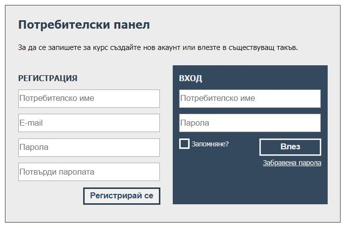
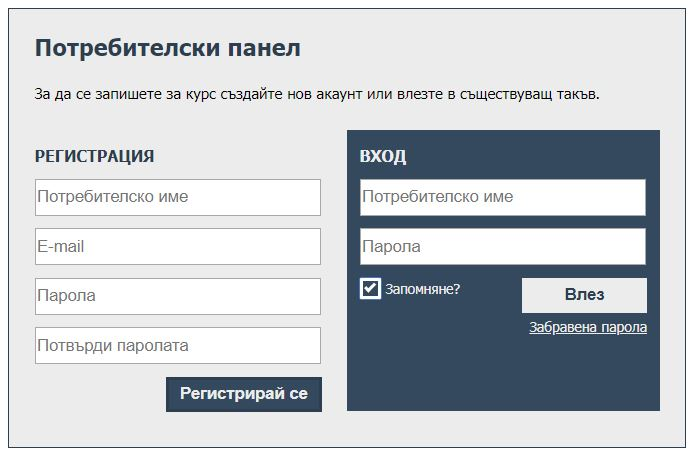

# Домашно 1
- Създайте файл с разширение .html и съдържание изцяло и единствено на български език, отговарящ на съдържанието, което се вижда в прикачените дизайни.
- Създайте файл с разширение .css, който да съдържа всички стилизации, необходими за постигане на дизайна в изображенията (без inline или internal стилове).
- Второто изображение (отдясно) е дадено като пример как трябва да изглеждат бутоните при hover и checkbox-а при click.
- Стиловете не е нужно да съвпадат на 100% (например цветове, шрифт и т.н.), но е хубаво да се придържате към зададения layout.

